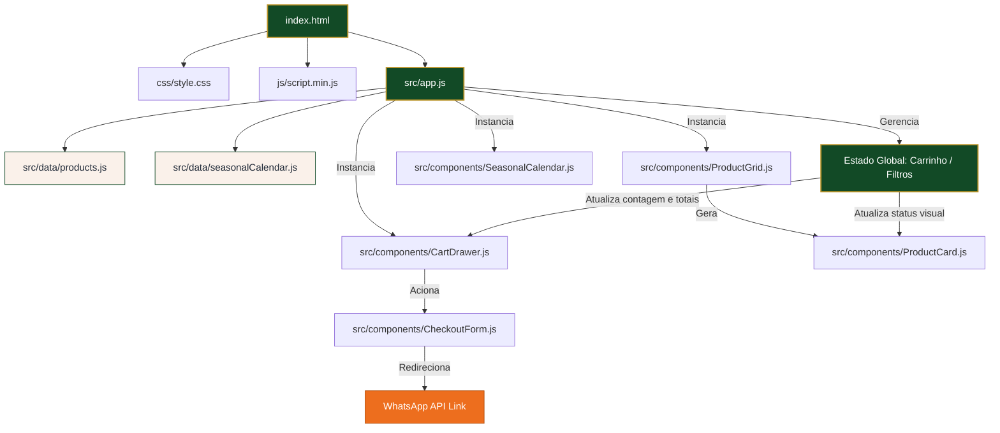

# JR Hortifruti Delivery — Arquitetura e Organização do Projeto

Este documento detalha a arquitetura, a estrutura de diretórios, o fluxo de orquestração do sistema e as recentes otimizações de performance aplicadas ao projeto **JR Hortifruti Delivery**. Ele serve como guia oficial de onboarding para futuros desenvolvedores.

---

## 1. Visão Geral da Arquitetura

O projeto foi desenvolvido seguindo o modelo de **Single Page Application (SPA)** leve e estática, sem a necessidade de frameworks complexos de build (como React, Angular ou Vue). Isso garante que o site carregue em milissegundos mesmo sob conexões móveis lentas, mantendo o código modular e altamente legível.

### Pilares da Arquitetura:
1. **Separação de Responsabilidades**: A lógica de visualização (Componentes), os dados comerciais (Data) e os estilos (CSS) são mantidos isolados e modulares.
2. **Componentização Vanilla**: Utilização de classes e funções ES6 para renderização dinâmica de componentes HTML no DOM.
3. **Mídia Otimizada**: Imagens no formato digital WebP de última geração e vídeo em H.264 otimizado para streaming móvel.
4. **Checkout Serverless**: O carrinho de compras e o processamento de pedidos ocorrem inteiramente no cliente, integrando-se diretamente à API do WhatsApp.

---

## 2. Estrutura de Diretórios (Árvore de Arquivos)

```txt
/ (Raiz do Projeto)
├── index.html               # Ponto de entrada único (SPA Container)
├── css/
│   └── style.css            # Folha de estilos unificada (inclui animações e media queries)
├── js/
│   ├── analytics.js         # Rastreamento e métricas de tráfego
│   ├── hotjar-514809.js     # Gravação de sessões e mapas de calor
│   └── script.min.js        # Lógica legada de transição e animações
├── media/
│   ├── automne.mp4          # Vídeo secundário
│   └── video-hortifruti.mp4 # Vídeo de fundo da Hero (comprimido em H.264, 4.2MB, faststart)
├── public/                  # Diretório de ativos públicos e estáticos
│   ├── *.webp               # Imagens de produtos e institucionais convertidas em WebP
│   ├── *.svg                # Logotipos vetorizados
│   └── hezitech_logo.webp   # Identidade da desenvolvedora
├── src/                     # Código-fonte principal da aplicação
│   ├── app.js               # Inicializador do app, roteamento e controle de estado
│   ├── components/          # Componentes de interface renderizados via JS
│   │   ├── CartDrawer.js    # Painel lateral do carrinho de compras
│   │   ├── CheckoutForm.js  # Lógica de fechamento e formatação do pedido
│   │   ├── ProductCard.js   # Card individual de produto
│   │   ├── ProductGrid.js   # Grade container de exibição dos cards
│   │   └── SeasonalCalendar.js # Calendário de safra interativo
│   └── data/                # Bases de dados locais e estruturadas
│       ├── products.js      # Catálogo de produtos (IDs, nomes, imagens WebP, preços)
│       └── seasonalCalendar.js # Mapeamento de produtos por época do ano
├── docs/                    # Documentação do projeto (este arquivo e históricos)
└── vercel.json              # Configurações de implantação contínua (Vercel CI/CD)
```

---

## 3. Orquestração e Fluxo de Dados (Organograma)

O diagrama abaixo ilustra como os diferentes módulos da aplicação se integram para gerenciar a renderização de componentes, o estado do carrinho e o fluxo de compra do cliente:



---

## 4. Gerenciamento de Estado e Ciclo de Vida

1. **Carregamento**: `index.html` carrega o contêiner básico. O script `src/app.js` é executado como um módulo ES6.
2. **Hidratação**: `app.js` importa os dados de `products.js`, filtra por categoria ativa e renderiza a `ProductGrid`.
3. **Escuta de Eventos**: Cada `ProductCard` escuta cliques nos botões de incremento/decremento. Ao ser clicado, ele dispara mutações no estado global do carrinho contido no `app.js`.
4. **Sincronização**: A cada mudança no estado do carrinho, o componente `CartDrawer` é notificado e redesenha sua interface para exibir o total atualizado, e os cards de produtos refletem as quantidades selecionadas.
5. **Finalização**: Ao clicar em "Finalizar Pedido", os dados do carrinho são convertidos em texto codificado para URI (`encodeURIComponent`) e o usuário é redirecionado para o WhatsApp com o pedido já digitado.

---

## 5. Histórico e Detalhes de Atualizações (Foco em Performance e Mobile)

Para atender a uma experiência mobile excelente nas larguras de tela mais comuns (**360px, 390px, 414px, 430px**), foram aplicadas as seguintes melhorias na arquitetura física e de renderização:

### A. Conversão Completa para WebP
* **Ação**: 81 imagens PNG e JPG da pasta `public/` e `images/` foram convertidas em lote para `.webp` (qualidade 85).
* **Impacto**: O peso dos ativos gráficos do site caiu em mais de **80%**, acelerando drasticamente o "First Contentful Paint" (FCP) em conexões 3G e 4G.

### B. Otimização Física de Vídeo (Mobile-First)
* **Ação**: O vídeo de fundo `video-hortifruti.mp4` foi re-codificado para H.264 720p com taxa de compressão CRF 28 e a faixa de áudio foi descartada (`-an`), reduzindo o arquivo de **18.1MB para 4.2MB**.
* **Flag `faststart`**: Adicionada a ordenação de metadados no início do arquivo de vídeo. O navegador móvel começa a rodar o vídeo assim que recebe os primeiros bytes, eliminando lentidão ou travamentos iniciais.

### C. Ajuste do Menu de Navegação
* **Ação**: Implementação de `margin-top: 190px !important` sob a media query `max-width: 768px` para o seletor `#menu .wrap>ul`.
* **Impacto**: Garante que os links de navegação não fiquem escondidos ou sobrepostos pelo logotipo circular flutuante do cabeçalho nas telas de celulares compactos.

### D. Exibição Completa do Proprietário ("Quem atende você")
* **Ação**: Remoção da altura fixa de `300px` do `.owner-image-container` no mobile (`height: auto !important`) e estilização da `.owner-image` com `width: 100% !important; height: auto !important; object-fit: contain !important;` na media query de `max-width: 600px`.
* **Impacto**: A imagem do proprietário (Junior) é exibida inteiramente, sem cortes na cabeça ou tronco, mantendo a proporção original da foto em todas as resoluções de smartphones.
